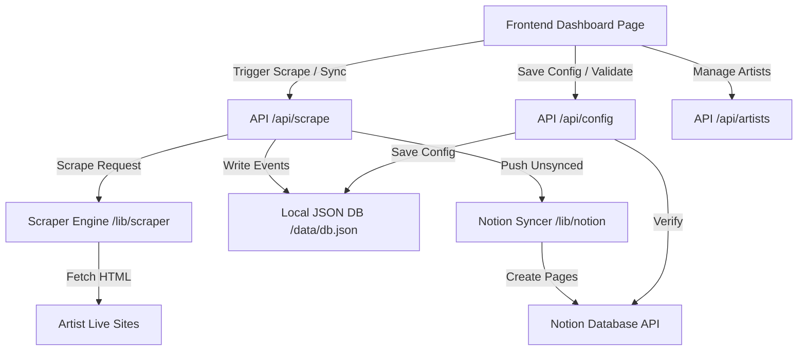

# Documentation Index

Welcome to the **Artist Live Info Scraper & Notion Sync App** documentation. This directory contains detailed information about the system architecture, specifications, features, and guidelines for future development.

## Documentation Files

1. **[System Specification](specification.md)**
   * Core requirements, data models, database schema, and Notion integration details.
2. **[Features & Implementation](features.md)**
   * Breakdown of the scraper, Notion syncer, backend API endpoints, and frontend dashboard.
3. **[AI Development Instructions](ai_instructions.md)**
   * A structured guide and prompt context for future AI coding assistants to maintain, debug, and extend this codebase.

## System Architecture Overview

---

## Technical Stack

* **Framework:** Next.js (App Router, TypeScript)
* **Scraping:** Cheerio (HTML Parsing)
* **Notion Integration:** `@notionhq/client` (Official Notion SDK)
* **Local Database:** File-based JSON Database (`data/db.json`)
* **Process Manager (Production):** PM2 (for Raspberry Pi deployment)
